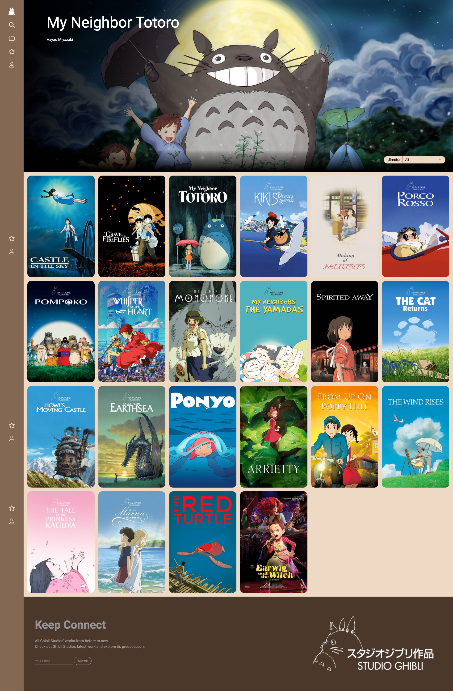

# GhibliJourney

## :gem: 사용한 기술

## 프로젝트 소개

- GhibliJourney는 지브리 스튜디오 작품을 처음 접하는 사람들이 작품을 구경하고, 간단한 내용을 확인할 수 있는 사이트입니다.
- 포스터 영역에 마우스를 호버함으로 원제목과 해당 작품의 평점을 확인할 수 있습니다.
- 포스터를 클릭함으로 작품의 간단한 정보를 열람할 수 있습니다.
- 검색을 통해 작품을 찾아볼 수 있습니다.

## :airplane: 결과

진행기간 : 2024.04.18 ~ 2024.04.25

## :clipboard: 구현할 기능 목록

- 반응형 디자인
- 자동 슬라이드 효과
- api를 활용한 데이터 제어
- 작품 클릭시 상세 정보 modal 출력
- 작품 호버시 제목 및 로튼토마토 지수 출력

## :warning: 해결해야하는 부분

| 문제 영역                     | 문제 내용                                                                                                                                             | 해결                                                                                                                                                                            |
| ----------------------------- | ----------------------------------------------------------------------------------------------------------------------------------------------------- | ------------------------------------------------------------------------------------------------------------------------------------------------------------------------------- |
|  | 포스터를 클릭하면 해당 포스터가 나타내는 영화의 상세정보를 modal에서 확인해야하는데 클릭 이벤트와 render 는 별도로 있기에 데이터를 별도로 연결해야 함 | api에 id 를 dataset에 주어 포스터를 클릭하면 그 값을 전달해 디테일에 접근하게 해결                                                                                              |
|  | api에서 가져온 배너 이미지의 사이즈가 동일하지 않음.                                                                                                  | api 데이터에는 직접 접근을 할 수 없기 때문에 배너 이미지 영역 사이즈를 고정값으로 지정                                                                                          |
|  | 검색기능 사용 후 갱신된 데이터에 스와이퍼가 적용되지 않음.                                                                                            | 새로운 데이터가 갱신될 때 랜더링이 필요하다고 판단하여 랜더링이 이루어지는 함수 내부에 스와이퍼 함수를 배치                                                                     |
|  | 파일문제로 다시 클론 받아 live 서버를 실행하니 이전에는 없던 문제가 발생.                                                                             | 이전에 `.gitignore`에 올린 `setting.json` 항목에 서버에서 허용하는 포트번호와 일치하게 설정해주는 부분이 업로드 되지 않음을 확인 `liveServer.settings.port` 로 포트 번호를 지정 |

## :warning: 미구현 기능

- header 개인정보 설정
- header 찜한 정보 확인 영역
- header 저장한 폴더 확인 영역

## :warning: Pain Point

- APi 에서 제공되는 파라미터가 적어 카테고리 및 추가 기능을 구현하는데 제한이 있음.
- APi 데이터 종류가 적음.

## :file_folder: 파일 구조 및 파일명

- :open_file_folder: petSuppliesWebClone
  - :memo: index.html
  - :memo: .gitignore
  - :open_file_folder: .vscode
    - :memo: settings.json
  - :open_file_folder: img
  - :open_file_folder: js
    - :memo: common.js
  - :open_file_folder: css
    - :memo: style.css
    - :memo: my_reset.css

## 참고 사이트

[swiper] <https://swiperjs.com/>  
[api] <https://ghibliapi.vercel.app/>  
[mdn] <https://developer.mozilla.org/ko/>  
[rotten tomatoes] <https://www.rottentomatoes.com/>
